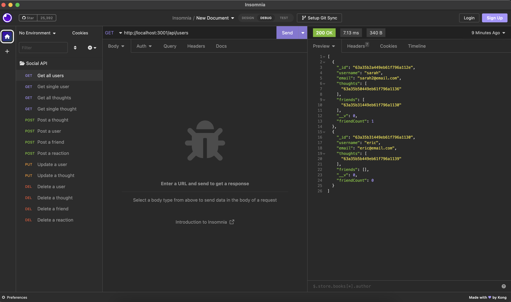

# Social Network API

## Description

This project creates a backend database for a social network utilizing MongoDB - specifically Mongoose - to categorize and create the data. Throughout this project, I learned a lot about how to correctly manipulate data via Mongoose, as well as how to write routes using controllers to populate the functionality.

## Installation

To install this project, please download the GitHub repository and run npm install.

## Usage

After installing the GitHub repository, you will need to run npm start to start the server, and then use an application like Insomnia to manipulate the database data, as this is all backend.

Additionally, here is a [tutorial video](./assets/recording.mov) to demonstrate how the project works.

## Credits

AskBCS for helping with questions.

## License

MIT License
